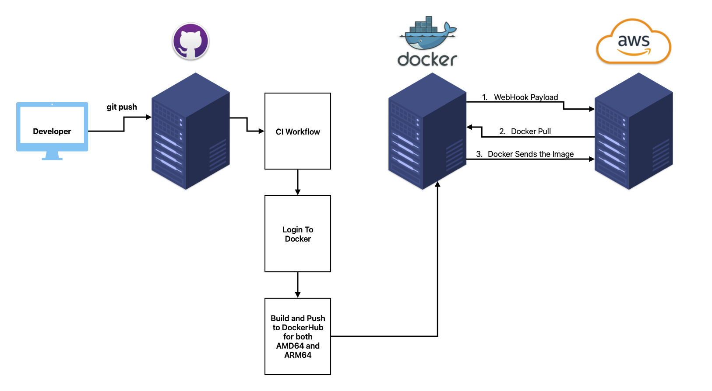

<h1 align="left">Project 5: Docker Continuous Deployment</h1>
<br/>

## Project Overview
This project stems off of the previous one dealing with Continuous Integration. From the continuous integration
this implements continuous deployment. This project implements this by using webhooks to know when to re pull a 
docker repo and restart the application.
- Tools:
  - [adnanh/webhook](https://github.com/adnanh/webhook)
    - This helps the AWS instance listen for changes made to my Docker Repo.
  - AWS



## GitHub Tags
In your Github repository there is a drop down that typically shows the different
 branches on your repo. This also shows the different tags, in this dropdown, the second 
header shows the different tags associated with the repository.
- You can create a tag with a commit by doing the following:
  1. Create a commit
        ```shell
        git add file/path
        git commit -m "your commit message"
        git tag -a v#.#.# -m "Your tag description"    
        ```
     This will tag your commit, an example tag would look like: `v1.0.0`
  2. Pushing your changes and tag to GitHub is similar to how you would push a branch.
        ```shell
        git push origin v#.#.#
        ```
     
## GitHub workflow for Semantic Versioning
My workflow builds my image and then pushes to DockerHub under 3 different tags `latest, major, minor`.
 This is only done when a new tag to commited to the repo.  
EX:
```
:latest
:1 
:1.0
```
- The 1 is the major version with the 1.0 being the minor version.

### Workflow steps:
1. The workflow sets up QEMO and Buildx so that the image can be built for both arm64 and amd64.
2. The workflow uses my username and personal access token stored in my repos secrets to login to dockerhub.
3. The workflow builds and pushes the 3 different tags for both amd64 and arm64.

If this workflow was to be used in a different repository the images field under `Grab MetaData` would need to change
```yaml
# From:
with:
  images: ${{ secrets.DOCKER_USERNAME }}/wasky-ceg3120

#To:
with:
  images: ${{ secrets.DOCKER_USERNAME }}/repo-name-here
```
My workflow: https://github.com/WSU-kduncan/ceg3120-cicd-Wamski/blob/main/.github/workflows/DockerPush.yml.old

### Checking if the workflow completed:
1. Go to your Docker Hub repo and see if there are now 3 tags instead of just latest.
2. Try to `docker pull` the different tags
```shell
docker pull wamski/wasky-ceg3120:latest
docker pull wamski/wasky-ceg3120:1
docker pull wamski/wasky-ceg3120:1.0
```
3. Then make sure each image is able to start up.
```shell
docker run -it -p 5001:4200 wamski/wasky-ceg3120:latest
docker run -it -p 5001:4200 wamski/wasky-ceg3120:1
docker run -it -p 5001:4200 wamski/wasky-ceg3120:1.0
```

## EC2 Instance
Instance Details:
- AMI: `Ubuntu 24.04`
  - ami-04b4f1a9cf54c11d0
- Instance Type: `t2.medium`
- Volume Size: `30 Gb`
- Security Groups:
  - Inbound (Opened):
    - All IPs on port 9000 because the webhook rule makes sure that the request comes from my Docker Repo
    - Port 22 for both WSU's subnet and my home WIFI
    - All IPs on port 80 to view the website
    - All traffic within the internal subnet

## Installing Docker
To install docker run the command `sudo apt install docker.io` or use a cloud formation template that includes it.
- To confirm that docker installed correctly simply run the command `docker` and it should print a list of commands.

If your docker is installed you can now pull images `docker pull wamski/wasky-ceg3120:latest`
- You can now run the image by doing either:
  - `docker run -it --name CEG3120 -p 80:4200 wamski/wasky-ceg3120:latest`: this runs the image in an interactive mode.
  - `docker run -d --name CEG3120 -p 80:4200 wamski/wasky-ceg3120:latest`: this runs the image in a detached mode. Meaning the images is running
 in the background and the console is still able to be typed in.

The tags in these run commands mean the following:
- `--name`: name the container
- `-p`: assign a host port to serve the container
- `-it`: an interactive mode, this runs the container/image in the foreground.
- `-d`: a detatched mode, this runs the container/image in the background.

## Testing your image
- After running the docker run command, you should see `✔ Compiled successfully.`
- In your Instance's console you can run `docker ps` and it will tell you the status of the image.
- On your host you can go to `http://{yourip}/` and it should show your application.
  - http://3.230.88.186/

## Refreshing your image
- First run this command to stop your image: `docker kill CEG3120`
- Second remove the image by running: `docker rm CEG3120`
- Thirdly pull the latest image: `docker pull wamski/wasky-ceg3120:latest`
- Lastly start the image by re-running your run command: `docker run -d --name CEG3120 -p 80:4200 wamski/wasky-ceg3120:latest`

## Container refresh script
Have a bash script do the commands in the "Refreshing your image" section.
- Run the script by either running `bash your_script` or if you include the shebang `./your_script`
  - This will output all the logs that manually typing the commands would.
  - [My Refresh Script](Deployment/CDScript)

## Configuring a webhook listener
1. In your instance's terminal run the command `sudo apt-get install webhook`
   - To make sure it is properly installed run `webhook --help` and it should list the different flags related to webhook.
2. Make webhook definition file that runs the [Refresh Script](Deployment/CDScript) when Docker Hub tells the webhook that a push had been made.
    - [My Definition File](Deployment/hooks.json)
3. While in the same directory as your definition file run the following: `sudo webhook -hooks hooks.json -verbose`
   - This runs your webhook without it being a service.

To make sure that your webhook is receiving payloads you can do the following
- On your browser and go to `http://3.230.88.186:9000/hooks/CDScript` This will show you if your hook rules are correct 
because if it doesn't display `Hook rules were not satisfied` and then runs the script that means there is something wrong with your definition file.
- In your instances terminal run the command `journalctl -u webhook.service` and this will list out all of the logs relating to the webhook.
- In `docker ps` look for the `STATUS` section to see if your instance is serving the container.

## Configuring a payload service
For my project I chose to use Docker Hub as my Payload sender because it only sends out webhooks for pushes to the repo, making it
easier to write the definition file.

To make Docker Hub send payloads to the instance
1. Go to your repo in Docker Hub
2. Click on the webhooks tab
3. Title the webhook something that you'll remember: `AWS-INSTANCE`
4. Give it a URL (This will be the same as the URL from the Configuring a webhook listener): `http://3.230.88.186:9000/hooks/CDScript`
5. Save the webhook

Docker Hub will send a play load to the EC2 Instance once it recieves a push to the repo.
- To verify this worked properly, make a change to the HTML in the app and tag & push this change to GitHub.
- Wait for this change to be pushed to DockerHub and soon your instance should recieve a webhook and run your refresh script.
- This should cause a visual change in the app.

## Configuring a webhook service
In `/usr/lib/systemd/system/webhook.service` There should be a line that runs when the service is started.
- This is `ExecStart=/usr/bin/webhook -nopanic -hooks /home/ubuntu/Deployment/hooks.json` which grabs the definition file on start and uses that file to monitor for what is defined.

You can enable this service by running `sudo systemctl enable webhook.service`
- Then you can start it by running `sudo systemctl run webhook.service`

To verify that the service has started and is running your webhook listener, make a change to the html files and visually confirm once it makes it to
Docker Hub if changes are made to your app.
[My Service File](Deployment/webhook.service)
- When making the service file I learned that `ExecStart=` can only run 1 command, so I created another
bash script that first runs [my refresh script](Deployment/CDScript) so that the instance is serving my app upon the instance starting. Then a line 
starting the webhook listening to [my definition file](Deployment/hooks.json).
  - [My start webhook script](Deployment/StartWebhook)

## Resources
- Adding tags to workflow: https://docs.docker.com/build/ci/github-actions/manage-tags-labels/
- Git Tag: https://graphite.dev/guides/git-push-tag
- Major/Minor: https://github.com/docker/metadata-action
- Trigger Rule: In class demonstration of webhooks (Lecture Date: 04/25/2025)